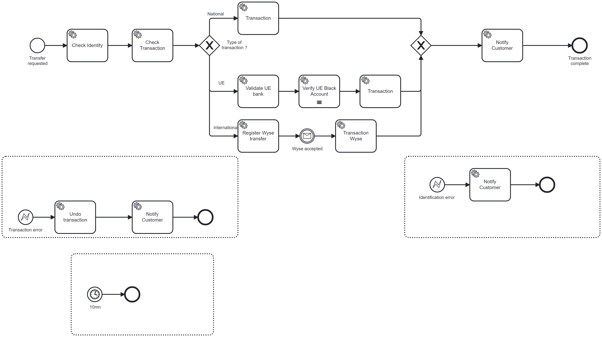

# Load Test Challenge

## Introduction

This challenge is crucial for ensuring that Bank of Andorra can efficiently handle a high volume of requests.

## Specifications

### Process
Bank of Andorra needs to process a substantial number of requests for a new process, as shown in the image below: 

 

For further details, please consult the file [BankOfAndora.bpmn](../BankOfAndora.bpmn). 

### Number of process instance per hour
The bank aims to process 800,000 PI (Process Instances) per hour within this process. 

### Estimate time per activity

The estimated times for executing various service tasks are:

| Task                     | Time to complete      | 
|--------------------------|-----------------------|
| check-identity           | 30 ms                 |
| check-transaction        | 100 ms                |
| national-transaction     | 1200 ms               |
| validate-UE-bank         | 300 ms                |
| verify-accreditation-org | 400 ms per validation |
| ue-transaction           | 1300 ms               |
| wyse-registration        | 1200 ms               |
| wyse-transaction         | 1400 ms               |
| notify-customer          | 80 ms                 |
| undo-transaction         | 4300 ms               |

For the proof of concept (POC), only UE transactions will be created, **with two accredited organizations: the European Bank and National Andorra Bank**.

Workers are developped in a classical method: the worker get a job, do the treatment and complete the job.

# Expectations

How many brokers and partitions will be needed? For each worker, how many threads and pods should be allocated? Upon determining the configuration, a 15-minute load test will be conducted to validate the results.