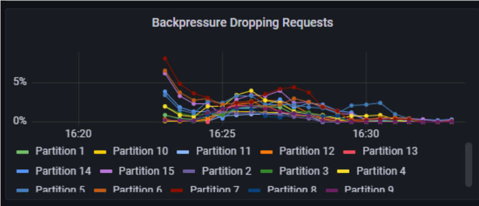
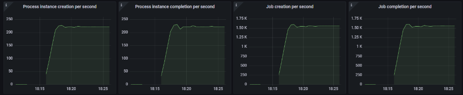
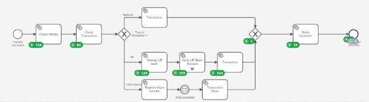

# Load Test Challenge Explanation

# Introduction

This challenge aims t
o find the correct configuration to handle the load test of Bank Of Andorra.

# Estimate the load

According to the specifications:
Number of service tasks per second:

| label                                 |          Value |
|---------------------------------------|---------------:|
| Number of PI/hour                     |   800,000 PI/h |
| Number of PI/s                        |       223 PI/s |
| Number of service task/PI             |    5 + 1*2 = 7 |
| Number of service tasks/s             |  1,561 Tasks/s |
| Number of service tasks/partition (*) |            150 |
| Number of partitions                  |             11 |


(*) Where come this number? SaaS environment explain a Large Saas Environment can handle 500 services tasks per second, with 3 partitions.
Visit https://docs.camunda.io/docs/components/best-practices/architecture/sizing-your-environment/#camunda-8-saas
So, the metric is 500/3 = 166 services task/partition. We use 150 as a conservative way. We will see during this load test that multiple factors impact the number of partitions. 
But this value is a good starting point.


So, the idea is to start with 11 partitions.

Next steps consist of identifying the number of worker threads.

The method is the following:
* calculate the CAPACITY of one thread
* calculate the LOAD of the worker


The calculation is based on a period of time. The minute is a good candidate if the service task run under the minute. Else, choose a larger base, like the hour.

In hour situation, all service task is around the second, so we consider the minute as a good candidate.

The CAPACITY is the work one thread can handle. For example, if a task need 20 seconds to proceed, the capacity for a thread in a minute is 3: the thread can run 3 tasks in the minute
How to calculate that? 

````
Capacity/minute = 60 / DurationOfOneTaskInSecond
````

The LOAD is the work the cluster need to provide. For example, if there is 20 tasks to execute per second, that's mean the load is 20*60 tasks per minute.

````
Load/minute = numberOfTask in the minute 
````

The number of threads is then the Load/Capacity. If you have to perform 5 task per minute, and one thread can handle 3 tasks per minute, you need 2 threads

At the end, number of worker is an estimation. In Camunda 8, a worker can host multiple threads. It's really depends on the work itself, and the implementation.
A service which need to turn a JPEG image is very CPU consuming, and maybe the worker can handle only 10 threads before it overload the CPU of the pod.
On the other range, when the worker just send a REST API to an external service, the worker can handle 300 threads, and if it implement the Reactiv programmation, maybe 1000 jobs at a time.


Capacity per worker:

| Service                  |  Execution (ms) | Capacity/mn |
|--------------------------|----------------:|------------:|
| check-identity           |              30 |        2000 |
| check-transaction        |             100 |         600 |
| national-transaction     |            1200 |          50 |
| validate-UE-bank         |             300 |          20 |
| ue-transaction           |            1300 |          46 | 
| wyse-registration        |            1200 |          50 |
| wyse-transaction         |            1400 |          42 |
| notify-customer          |              80 |         750 |
| undo-transaction         |            4300 |          13 |

Load per worker:

| Service                  | Nb tasks/process |Number of task/s |  Load/mn |
|--------------------------|-----------------:|----------------:|---------:|
| check-identity           |                1 |             223 |    13380 |
| check-transaction        |                1 |             223 |    13380 |
| national-transaction     |                1 |             223 |    13380 |
| validate-UE-bank         |                1 |             223 |    13380 |
| verify-accreditation-org |                2 |             446 |    26760 |
| ue-transaction           |                1 |             223 |    13380 |
| wyse-registration        |                1 |             223 |    13380 |
| wyse-transaction         |                1 |             223 |    13380 |
| notify-customer          |                1 |             223 |    13380 |
| undo-transaction         |                1 |             223 |    13380 |


Calculation:
For an average, we use the value of 250 threads per worker.


| Service                  | Capacity/mn |   Load/mn | Nb threads (Load/Capacity) | Workers |
|--------------------------|------------:|----------:|---------------------------:|--------:|
| check-identity           |        2000 |     13380 |                       6.69 |       1 |
| check-transaction        |         600 |     13380 |                       22.3 |       1 |
| national-transaction     |          50 |     13380 |                      267.6 |       2 |
| validate-UE-bank         |          20 |     13380 |                       66.9 |       1 |
| verify-accreditation-org |         150 |     26760 |                      178.4 |       1 |
| ue-transaction           |          46 |     13380 |                      289.9 |       2 |
| wyse-registration        |          50 |     13380 |                      267.6 |       2 |
| wyse-transaction         |          42 |     13380 |                      312.2 |       2 |
| notify-customer          |         750 |     13380 |                      17.84 |       1 |
| undo-transaction         |          13 |     13380 |                      958.9 |       4 |


# Goal
We want to run a small test:

Running a 3 mn test, and warmup 1 mn, we expect
* To create 223*60*(3+1)=53520
* To process 223*60*3=40140 PI
* To reach 1561 tasks/s

# Scenario
The `process-execution-automator` is used to run a load test.

One Kubernetes deployment is started for each service task.

According to the rule “one pod host 250 threads worker”, ue-transaction will start 2 deployments.

# Enable metrics

Create the Graphana environment in the camunda-8-helm-profiles

````shell
cd metrics
make metrics
kubectl get service metrics-grafana-loadbalancer --namespace default
NAME                       	   TYPE       	  CLUSTER-IP 	  EXTERNAL-IP 	 PORT(S)    	AGE
metrics-grafana-loadbalancer   LoadBalancer   10.32.12.168   34.148.16.113   80:32264/TCP
````

Open a browser, access the external IP ( http://34.148.16.113), Login: camunda/camunda

# Execute the scenario

## 1. Create the cluster
Deploy the cluster (replace _1 by the correct test execution)

````shell
kubectl create namespace camunda
helm install --namespace camunda  camunda camunda/camunda-platform -f test_1/C8_BankOfAndora-1.yaml
````


## 2. Upload the process from the modeler

Upload the process
````shell
kubectl port-forward svc/camunda-zeebe-gateway 26500:26500 -n camunda
````

On the modeler, deploy the process `BankOfAndora.bpmn`

## 3. Load the scenario

Load the scenario in a config map

````shell
cd solution
kubectl create configmap bankscn --from-file=SCN_BankOfAndora.json
````

## 4. Start the test
Start the test:

````shell
kubectl create -f test_1/LoadTest_BankOfAndora-1.yaml
kubectl get pods
kubectl logs -f pa-creation-55f4467c96-z5j5j
````

and to stop it, use
````shell
kubectl delete -f test_1/k8_BankOfAndora-1.yaml
````

# Test 1
Create the cluster with 11 partitions:
````yaml
global:
  identity:
    auth:
      enabled: false

identity:
  enabled: true

identityKeycloak:
  enabled: false

tasklist:
  enabled: true


optimize:
  enabled: false

connectors:
  enabled: false

zeebe:
  clusterSize: 11
  partitionCount: 11
  replicationFactor: 3
  pvcSize: 10Gi

zeebe-gateway:
  replicas: 2

elasticsearch:
  master:
    replicaCount: 1
    persistence:
      size: 15Gi

prometheusServiceMonitor:
  enabled: true
````


Install it:
````shell
kubectl create namespace camunda

helm install --namespace camunda camunda camunda/camunda-platform -f test_1/C8_BankOfAndora-1.yaml
````


Run the different port-forward on Zeebe
Result:
On Operate:


On Grafana


Result:

| Item       |  Goal | Result |
|------------|------:|-------:|
| Creation   | 53520 | 129037 |
| Process    | 40140 |   9319 |
| Throughput |  1561 |    250 |


There is a lot of backpressure, and the task `checkTransition` is a bottleneck, with more than 96790 jobs waiting here. 

# Test 2
To avoid backpressure, let's increase the number of partitions to 15. 
The number of workers behind `checkTransition` is increase to 3.

````shell
kubectl create namespace camunda


helm install --namespace camunda camunda camunda/camunda-platform -f test_2/C8_BankOfAndora-2.yaml
````
Start the test

````shell
kubectl create configmap bankscn --from-file=SCN_BankOfAndora.json
kubectl create -f test_2/k8_BankOfAndora-2.yaml
kubectl get pods | grep crea
kubectl logs -f pa-creation-55f4467c96-z5j5j
````

At the end, stop the test by 

````shell
kubectl delete -f test_2/k8_BankOfAndora-2.yaml
````

Result





| Item       |  Goal | Result |
|------------|------:|-------:|
| Creation   | 53520 | 113564 |
| Process    | 40140 |   5792 |
| Throughput |  1561 |    1200 |

There is still some backpressure. The `checkTransition` is not anymore a bottleneck, but now next task appears as bottleneck


# Test 3
Still some backpressure: increase the number of partition to 18. Increase the ES CPU to 5

Increase the number of workers:

check-transaction to 5 (+1)
Validate-ue-bank to 6 (+2)
Verify-accreditation to 6 (+2)
Transaction to 5 (+4)

````shell
kubectl create namespace camunda

helm install --namespace camunda camunda camunda/camunda-platform -f test_4/C8_BankOfAndora-4.yaml
````

Start the test

````shell
kubectl create configmap bankscn --from-file=SCN_BankOfAndora.json
kubectl create -f test_3/LoadTest_BankOfAndora-3.yaml
````
Stop the test by

````shell
kubectl delete -f test_3/LoadTest_BankOfAndora-3.yaml
````

Result
Have some overload during the creation
2024-06-06T00:45:13.247Z  INFO 1 --- [      Tran_BOA3] o.c.a.e.flow.RunScenarioFlowStartEvent   : Step #29-STARTEVENT Tran_BOA(StartEvent)] Create (real/scenario)[1769/2223 OVERLOAD] Failed[0] in 10995 ms


The backpressure is now tackle, but the number of process instance created does not follow correctly now.
Still some tasks stay in the process.

# Test 4

Update
Creation: set the number of thread to 120 (+20)
check-transaction to 4 (+1)
Validate-ue-bank to 4 (+2)
Verify-acreditation to 4 (+2)


````shell
kubectl create namespace camunda

helm install --namespace camunda camunda camunda/camunda-platform -f test_4/C8_BankOfAndora-3.yaml
````

Start the test

````shell
kubectl create configmap bankscn --from-file=SCN_BankOfAndora.json
kubectl create -f test_4/LoadTest_BankOfAndora-4.yaml
````
Stop the test by

````shell
kubectl delete -f test_4/LoadTest_BankOfAndora-4.yaml
````

Result






| Item       |  Goal |          Result |
|------------|------:|----------------:|
| Creation   | 53520 |          131817 |
| Process    | 40140 | More than 10000 |
| Throughput |  1561 |            1600 |

The goal is now reach! But there is one concern. Operate does not show the same result as Grafana. 
After stopping the test, still after 10 mn, Operate value still change. 
This is a sign Operate import is far away the reality


# Test 5 - Scale Operate

Update
Deactivate Operate from the Helm chart
<<TODO>>

Run manual a Operate deployment, with 3 Operate imports. There is 18 partitions, running 9 importer means each Operate will deal with 18/3=6 partitions.

```
kubectl apply -f operate-importer-0.yaml -n camunda
kubectl apply -f operate-importer-1.yaml -n camunda
kubectl apply -f operate-importer-2.yaml -n camunda
kubectl apply -f importer-service.yaml
```

Check the logs on one importer
```
2024-04-17 17:17:02.546  INFO 7 --- [           main] i.c.o.z.RecordsReaderHolder              : Starting import for partitions: [1,2,3,4,5,6]
```

